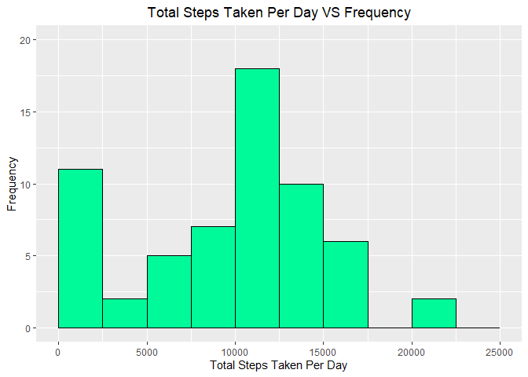
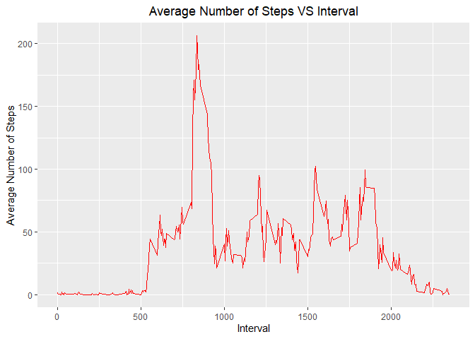
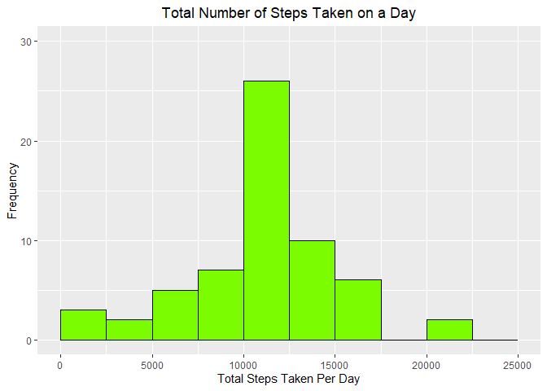
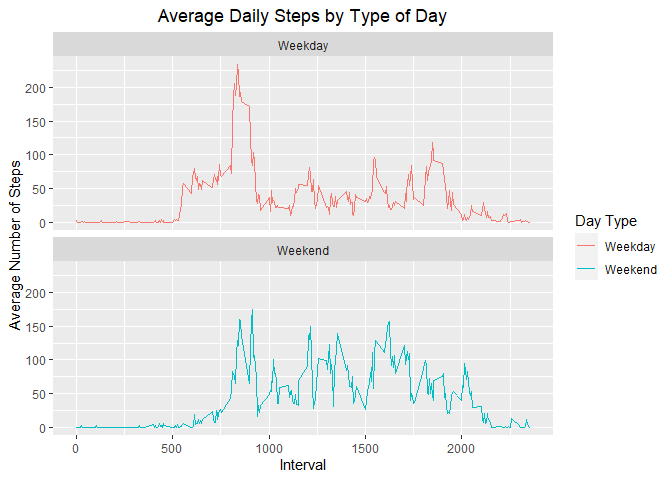

## Loading and preprocessing the activity

### Load the data


```r
activity_Url <- "https://d396qusza40orc.cloudfront.net/repdata%2Fdata%2Factivity.zip"

download.file(activity_Url,destfile="./activity.zip",method="curl")

unzip(zipfile="./activity.zip",exdir="./")
```

### Process/transform the data into a format suitable for your analysis


```r
activity <- read.csv("activity.csv", header=TRUE, sep=",")

# Changing date format to get the weekdays of the dates
activity$date <- as.POSIXct(activity$date, "%Y%m%d")

# Getting the days of all the dates on the activity dataset
day <- weekdays(activity$date)

# Combining the activity data with the weekday of the dates
activity <- cbind(activity, day)

# Viewing the summary of activity dataset
summary(activity)
```

```
##      steps             date               interval          day           
##  Min.   :  0.00   Min.   :2012-10-01   Min.   :   0.0   Length:17568      
##  1st Qu.:  0.00   1st Qu.:2012-10-16   1st Qu.: 588.8   Class :character  
##  Median :  0.00   Median :2012-10-31   Median :1177.5   Mode  :character  
##  Mean   : 37.38   Mean   :2012-10-31   Mean   :1177.5                     
##  3rd Qu.: 12.00   3rd Qu.:2012-11-15   3rd Qu.:1766.2                     
##  Max.   :806.00   Max.   :2012-11-30   Max.   :2355.0                     
##  NA's   :2304
```

## What is mean total number of steps taken per day?

### Calculate the total number of steps taken per day
### Make a histogram of the total number of steps taken each day
### Calculate and report the mean and median of the total number of steps taken per day


```r
#Calculating total steps taken on a day as an array
activity_total_steps <- tapply(activity$steps, activity$date, FUN=sum, na.rm=TRUE)

#Converting array to dataframe
activity_total_steps <- data.frame(Date = names(activity_total_steps), Steps = 
                                     activity_total_steps)
#Cleaning row names
rownames(activity_total_steps) <- NULL

library(ggplot2)

# Plotting a histogram using ggplot2
plot_1 <- ggplot(activity_total_steps, aes(x = Steps)) + 
  geom_histogram(breaks = seq(0, 25000, by = 2500), fill = "#00FA9A", col = "black") + 
  ylim(0, 20) + 
  xlab("Total Steps Taken Per Day") + 
  ylab("Frequency") + 
  ggtitle("Total Steps Taken Per Day VS Frequency") + 
  theme(plot.title = element_text(hjust = 0.5))

# Calculating MEAN
mean_ac <- mean(activity_total_steps$Steps)

# Calculating MEDIAN
median_ac <- median(activity_total_steps$Steps)

# Printing all Results
print(plot_1)
```

<!-- -->

```r
print(paste("The mean total number of steps taken per day is:", mean_ac))
```

```
## [1] "The mean total number of steps taken per day is: 9354.22950819672"
```

```r
print(paste("The median of total number of steps taken per day is::", median_ac))
```

```
## [1] "The median of total number of steps taken per day is:: 10395"
```


## What is the average daily activity pattern?

### Make a time series plot of the 5-minute interval (x-axis) and the average number of steps taken, averaged across all days (y-axis)

### Which 5-minute interval, on average across all the days in the dataset, contains the maximum number of steps?


```r
# Calculating the average number of steps taken into dataframe
Avg_daily_activity <- as.data.frame(aggregate(activity$steps, by = list(activity$interval), 
                                  FUN = mean, na.rm = TRUE))
# Renaming Coloumn names
names(Avg_daily_activity) <- c("Interval", "Mean")

# Plotting a geom line plot on ggplot2
plot_2 <- ggplot(Avg_daily_activity, mapping = aes(Interval, Mean)) + 
  geom_line(col = "red") +
  xlab("Interval") + 
  ylab("Average Number of Steps") + 
  ggtitle("Average Number of Steps VS Interval") + 
  theme(plot.title = element_text(hjust = 0.5))

#Calculating Maximum steps
maxSteps <- max(Avg_daily_activity[,2])

#Calculating Intervals
Interval <- Avg_daily_activity[which.max(Avg_daily_activity$Mean), ]$Interval

#Printing Results

print(plot_2)
```

<!-- -->

```r
print(paste("The maximum number of steps per day is: ", maxSteps, "And the the interval is: ", as.numeric(Interval)))
```

```
## [1] "The maximum number of steps per day is:  206.169811320755 And the the interval is:  835"
```


## Imputing missing values

### Calculate and report the total number of missing values in the dataset (i.e. the total number of rows with NAs)


```r
tot_act_na <- sum(is.na(activity$steps))
print(paste("The total number of missing values is ", tot_act_na))
```

```
## [1] "The total number of missing values is  2304"
```

### Devise a strategy for filling in all of the missing values in the dataset. The strategy does not need to be sophisticated. For example, you could use the mean/median for that day, or the mean for that 5-minute interval, etc.

### Filling the missing values with mean value for that day.


```r
# Matching the missing values with mean value for that day.

Match_values <- Avg_daily_activity$Mean[match(activity$interval, Avg_daily_activity$Interval)]

# Replacing missing activity values with calculated match values
activity_matched <- transform(activity, 
                             steps = ifelse(is.na(activity$steps), 
                                            yes = Match_values, no = activity$steps))

# Writing the new dataset
Total_activity_matched <- aggregate(steps ~ date, activity_matched, sum)

# Assigning coloumn names
names(Total_activity_matched) <- c("Date", "Daily_Steps")
```

### Create a new dataset that is equal to the original dataset but with the missing data filled in.

### Testing the new dataset for any further missing values


```r
final_act_na <- sum(is.na(Total_activity_matched$Daily_Steps))
print(paste("The total number of missing values after imputing is ", final_act_na))
```

```
## [1] "The total number of missing values after imputing is  0"
```

### Make a histogram of the total number of steps taken each day and Calculate and report the mean and median total number of steps taken per day.
### Do these values differ from the estimates from the first part of the assignment?
### What is the impact of imputing missing data on the estimates of the total daily number of steps?


```r
# Plotting a histogram using ggplot2
plot_3 <- ggplot(Total_activity_matched, aes(x = Daily_Steps)) + 
  geom_histogram(breaks = seq(0, 25000, by = 2500), fill = "#7CFC00", col = "black") + 
  ylim(0, 30) + 
  xlab("Total Steps Taken Per Day") + 
  ylab("Frequency") + 
  ggtitle("Total Number of Steps Taken on a Day") + 
  theme(plot.title = element_text(hjust = 0.5))


#Caluclating mean and median of the total number of steps taken per day
mean_tam <- mean(Total_activity_matched$Daily_Steps)
median_tam <- median(Total_activity_matched$Daily_Steps)

#Printing Results
print(plot_3)
```

<!-- -->

```r
print(paste("The mean of the total number of steps taken per day is ", mean_tam))
```

```
## [1] "The mean of the total number of steps taken per day is  10766.1886792453"
```

```r
print(paste("The median of the total number of steps taken per day is", median_tam))
```

```
## [1] "The median of the total number of steps taken per day is 10766.1886792453"
```

## Are there differences in activity patterns between weekdays and weekends?

### Create a new factor variable in the dataset with two levels – “weekday” and “weekend” indicating whether a given date is a weekday or weekend day.


```r
# Updating format of the dates
activity$date <- as.Date(strptime(activity$date, format="%Y-%m-%d"))

# Creating a function that distinguises weekdays from weekends
activity$Type_Day <- sapply(activity$date, function(x)
  {
    if(weekdays(x) == "Saturday" | weekdays(x) == "Sunday")
      {
        y <- "Weekend"
      }
  else 
      {
        y <- "Weekday"
      }
        y
  }
)
```

### Make a panel plot containing a time series plot of the 5-minute interval (x-axis) and the average number of steps taken, averaged across all weekday days or weekend days (y-axis).


```r
# Creating the data set that will be plotted
activity_day <-  aggregate(steps ~ interval + Type_Day, activity, mean, na.rm = TRUE)

# Plotting using ggplot2
plot_4 <-  ggplot(activity_day, aes(x = interval , y = steps, color = Type_Day)) + 
  geom_line() + ggtitle("Average Daily Steps by Type of Day") + 
  xlab("Interval") + 
  ylab("Average Number of Steps") +
  facet_wrap(~Type_Day, ncol = 1, nrow=2) +
  scale_color_discrete(name = "Day Type") + 
  theme(plot.title = element_text(hjust = 0.5))

print(plot_4) 
```

<!-- -->
